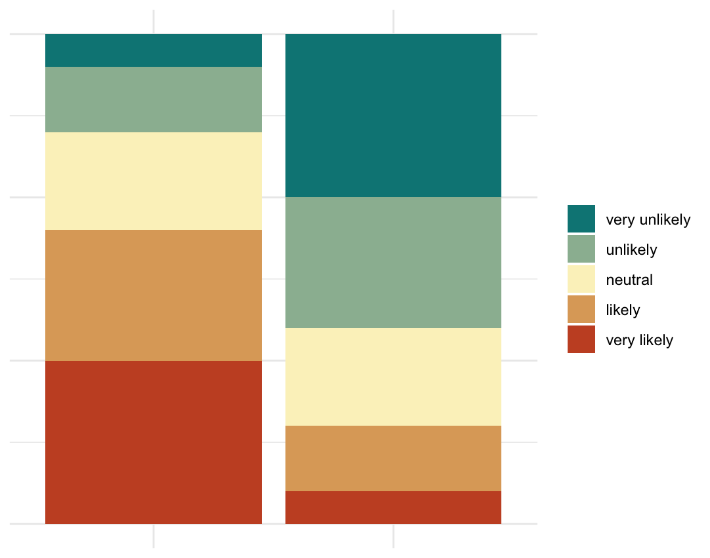
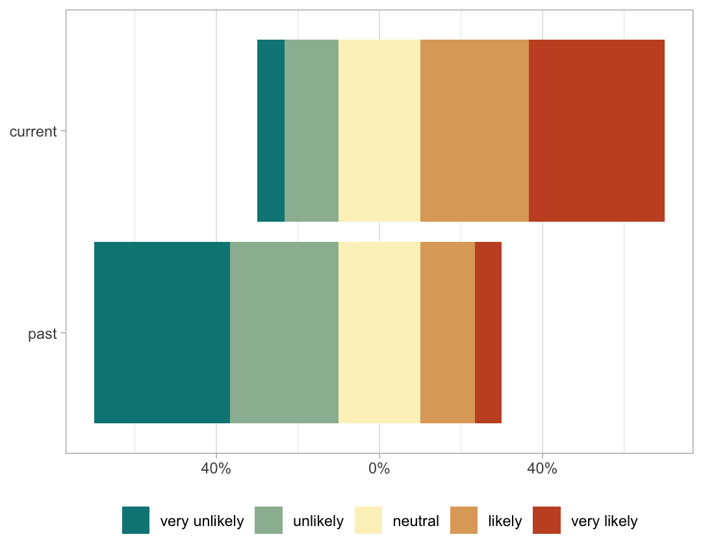

<div style="display: flex; gap: 10px;">
  
  
</div>

Website: [https://dicook.github.io/burnet-workshop/](https://dicook.github.io/burnet-workshop/)

This workshop is for data analysts at the Burnet Institute, designed to provide skills for improving plot design. It covers these topics:

- Data visualisation principles, including accessibility, colour choices, proximity, appropriate mapping of variables to visual elements
- Identifying poor elements in a plot
- Fixing a plot design
- Styling and theming plots
- Quantitatively assessing the best plot design, using lineups
- Incorporating uncertainty
- Writing alt-text for data plots

**Presenter**: [Dianne Cook](https://www.dicook.org), a Professor of 
Statistics at Monash University in Melbourne, Australia, is a global leader
in data visualisation. She has delivered over 100 invited talks 
internationally and published extensively on various aspects of data 
visualisation. Dr. Cook is a Fellow of the American Statistical 
Association, an elected member of the International Statistical 
Institute, past editor of the Journal of Computational and Graphical 
Statistics, and the R Journal. She has served as a Board Member of the 
R Foundation and is currently the co-chair of the Statistical Computing 
and Visualisation Section of the [Statistical Society of Australia](https://www.statsoc.org.au).

**Background**: You should have a basic understanding of R, be familiar 
with tidy data, and know how to use ggplot2. It's also helpful if you've 
read the material in [R4DS](https://r4ds.hadley.nz) and taken a first-year 
statistics course.

## Structure of tutorial

| time | topic | description |
|------:|:-------|:-------|
| 1:00  |	Data visualisation principles | Accessibility, colour choices, proximity, appropriate mapping of variables to visual elements |
| 1:30  | Identifying poor elements in a plot | With examples from the institute we will develop a list of what is good and what is not for each.  |
| 2:00  | Fixing a plot design	 | We will work with the examples from the institute to improve the designs in steps (if we have data and code available). |
| 2:30  | BREAK | |
| 3:00  | Quantitatively assessing the best plot design, and incorporating uncertainty	 | A lineup helps to assess whether the structure in a data plot is different from noise. We will show how this can be used to determine if one design makes it easier to read the structure than another. A second aspect of this session will be ways to incorporate representation of uncertainty in a plot to better communicate if patterns are important or not.   | 
| 3:30  | Styling and theming plots, and writing alt-text descriptions | Making plots have the same look and feel is easier if a template design is available. Here we will discuss ways to construct a template that can be used repeatedly. We will also discuss writing effective text descriptions of data visualisations to make them more accessible for vision-impaired readers, an important (and often required) aspect of report writing today. |
| 4:00  | Polishing your plots	 | This will be a hands-on session taking the previous designs, using lineups to determine which is better for communication, writing alt-text descriptions and developing themes. |

[Session 1 Slides]()

[Session 2 Slides]()

[Zip file of materials]()

## Software used for slides

R 4.5.0 (2025-04-11) -- "How About a Twenty-Six" and RStudio 2025.05.0+496 "Mariposa Orchid" Release (f0b76cc00df96fe7f0ee687d4bed0423bc3de1f8, 2025-05-04) 

```
install.packages(c("ggplot2", 
                   "tidyr", 
                   "dplyr", 
                   "readr", 
                   "readxl",
                   "stringr", 
                   "forcats",
                   "colorspace", 
                   "patchwork",
                   "broom", 
                   "ggbeeswarm", 
                   "ggmosaic",
                   "nullabor", 
                   "gapminder",
                   "ggthemes",
                   "conflicted"), 
                   dependencies=c("Depends", "Imports"))
```

## Source material

GitHub repo with all materials is 
[https://github.com/dicook/burnet-workshop/](https://github.com/dicook/burnet-workshop/).

## Other resources 

- [Healy (2018) Data Visualization: A practical introduction](https://socviz.co)
- [Wilke (2019) Fundamentals of Data Visualization](https://clauswilke.com/dataviz/)

## Attribution

Copyright: Dianne Cook 2025

These materials are licensed under a
[Creative Commons Attribution-NonCommercial-ShareAlike 4.0 International License][cc-by-nc-sa].

[![CC BY-NC-SA 4.0][cc-by-nc-sa-image]][cc-by-nc-sa]

[cc-by-nc-sa]: http://creativecommons.org/licenses/by-nc-sa/4.0/
[cc-by-nc-sa-image]: https://licensebuttons.net/l/by-nc-sa/4.0/88x31.png
[cc-by-nc-sa-shield]: https://img.shields.io/badge/License-CC%20BY--NC--SA%204.0-lightgrey.svg
